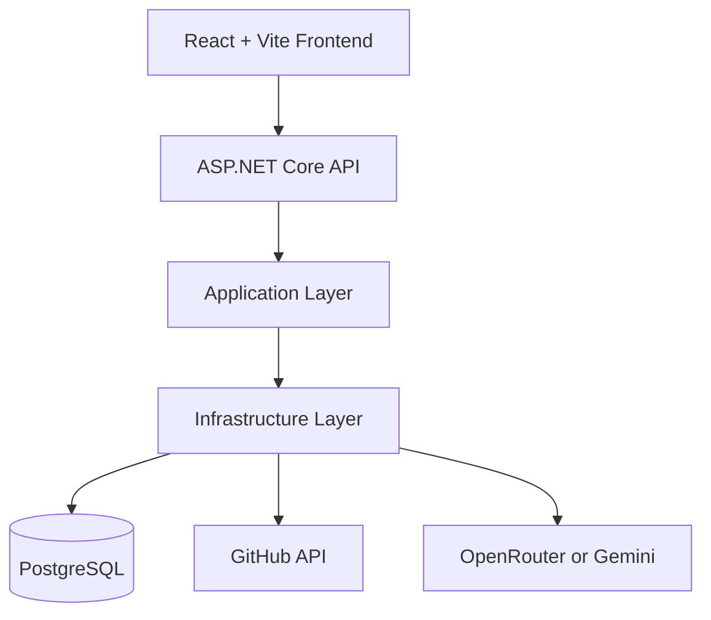

# RepoLens

RepoLens is a repository intelligence platform that analyzes public GitHub repositories, stores analysis history, and generates AI-assisted code review feedback.

## What It Does

- Add repositories using a GitHub URL.
- Fetch repository metadata from GitHub.
- Compute repository analysis metrics and keep historical results.
- Generate AI review output for a selected repository.
- Visualize results in a React dashboard.

## Architecture



## Tech Stack

- Backend: ASP.NET Core (.NET 10), Entity Framework Core, PostgreSQL
- Frontend: React 19, Vite 8, Tailwind CSS, Recharts
- Containers: Docker Compose

## Repository Structure

- `src/RepoLens.API`: Web API, controllers, startup, OpenAPI endpoint
- `src/RepoLens.Application`: interfaces, DTOs, business contracts
- `src/RepoLens.Domain`: domain entities
- `src/RepoLens.Infrastructure`: persistence, external services, DI wiring
- `frontend`: React client application
- `docker-compose.yml`: local multi-container setup

## Prerequisites

- .NET SDK 10.0+
- Node.js 18+
- npm
- Docker Desktop (recommended)

## Quick Start (Docker)

From the repository root:

```powershell
docker compose up -d --build
```

Services:

- Frontend: http://localhost:3000
- Backend API: http://localhost:5086
- PostgreSQL: localhost:5433

Stop services:

```powershell
docker compose down
```

## Local Development (Without Docker for App Services)

You can run PostgreSQL in Docker and run API/frontend locally.

1. Start only PostgreSQL:

```powershell
docker compose up -d postgres
```

2. Configure API settings in `src/RepoLens.API/appsettings.Development.json` (or `appsettings.json`):

```json
{
  "ConnectionStrings": {
    "DefaultConnection": "Host=localhost;Port=5433;Database=RepoLensDb;Username=postgres;Password=YOUR_PASSWORD"
  },
  "OpenRouterSettings": {
    "ApiKey": "YOUR_API_KEY",
    "Model": "cohere/north-mini-code:free"
  }
}
```

3. Run the backend:

```powershell
dotnet run --project src/RepoLens.API
```

4. Run the frontend:

```powershell
cd frontend
npm install
npm run dev
```

Frontend dev URL is usually shown by Vite (commonly http://localhost:5173).

## API Endpoints

Base URL: `http://localhost:5086/api`

- `GET /repositories`
- `GET /repositories/{id}`
- `POST /repositories` (body: `{ "gitHubUrl": "..." }`)
- `POST /repositories/{id}/analyze`
- `GET /repositories/{id}/analysis`
- `GET /repositories/{id}/history`
- `POST /repositories/{id}/review`
- `GET /github/{owner}/{repo}`
- `GET /api/test`

OpenAPI document is exposed by the API at runtime via the mapped OpenAPI route.

## Notes

- Database migrations are applied automatically on API startup.
- If AI requests hit provider limits, the API may return HTTP 429 for review generation.
- Do not commit real API keys. Keep secrets in local config or environment variables.
